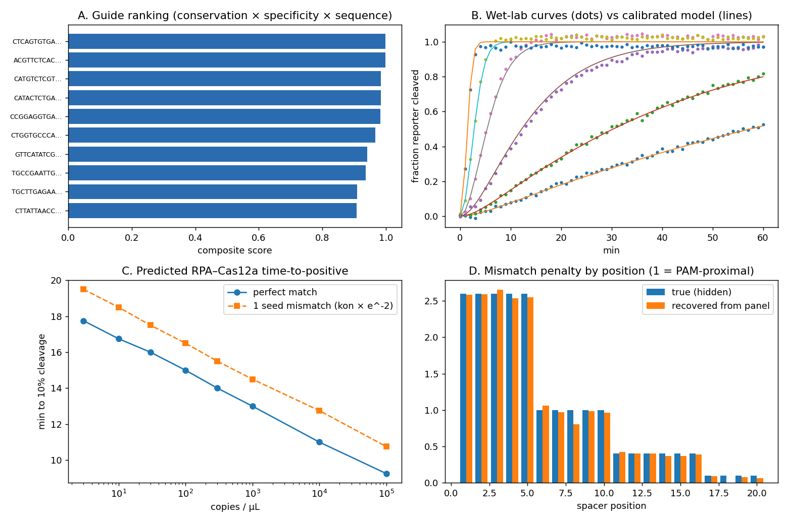

# Cas12a Dry-Lab Pipeline

A small, open Python pipeline for designing and modelling **CRISPR-Cas12a (+RPA) molecular diagnostics**, built so that every computed number can be **checked against a wet-lab measurement**.

> **Important:** the demo in this repository runs on **simulated sequences and simulated plate-reader data**. It is a software test, not a result about any real assay. Kinetic constants are order-of-magnitude placeholders that are meant to be replaced by values fitted from real data.



## What it does

| Step | What it does | Wet-lab data that can replace or check it |
|---|---|---|
| 1. Guide discovery | Scans both strands for TTTV-PAM protospacers (20 nt) | - |
| 2. Target validation | Predicts guide activity against every variant genome using a position-weighted mismatch model | Variant sequences, measured activity |
| 3. Specificity | Flags guides with a high predicted activity on background sequences (host, other pathogens) | Cross-reactivity tests |
| 4. RPA primers | Picks a primer pair (30-35 nt, 110-220 bp amplicon) around the best guide | Amplification tests |
| 5. Kinetic model | ODE model of Cas12a trans-cleavage with optional RPA amplification | - |
| 6. Calibration | Fits binding rate (kon) and kcat/KM to plate-reader curves, with confidence intervals | Fluorescence time courses |
| 7. Mismatch calibration | Learns per-position mismatch penalties from a measured mismatch panel (non-negative least squares) | Mismatch panel |
| 8. Prediction | Predicts time-to-positive across target copy numbers | Time-to-positive, LoD |

## Quick start

```bash
pip install -r requirements.txt
python cas12a_drylab_pipeline.py --demo
```

Outputs go to `drylab_out/`: `guides_ranked.csv`, `rpa_primers.json`, `calibration.json`, `predicted_time_to_positive.csv`, `dashboard.png`.

## Using real data

```bash
python cas12a_drylab_pipeline.py \
  --target target_reference.fa \
  --variants variant_genomes.fa \
  --background host_and_other_pathogens.fa \
  --wetlab plate.csv
```

`plate.csv` columns: `time_s, conc_nM, rep, fluor_norm` (fluorescence normalised from 0 to 1, where 1 = fully cleaved reporter). Use amplification-free titrations (e.g. 5-6 concentrations, 3 replicates) for calibration.

## Assumptions and limits

- The mismatch model uses fixed prior weights (strong penalty in the PAM-proximal seed, weak far from the PAM). These are a hypothesis until calibrated (step 7).
- With a single reporter concentration below KM, only kcat/KM is identifiable. KM is therefore fixed during fitting.
- RPA is modelled as simple logistic growth; real RPA has primer-dimer and stochastic effects that are not modelled.
- Even a perfect assay cannot reliably detect fewer than a few template copies per reaction (Poisson sampling).
- Secondary-structure scoring of guides, and tools such as CRISPOR, Cas-OFFinder, Primer3 and ViennaRNA, are natural next additions.

## Status

Prototype. Validated only on simulated data so far. Seeking real wet-lab data for calibration and blind testing.

## Author

Aaradhya Aggarwal, M.Sc. Biotechnology (Bioinformatics), TERI SAS
